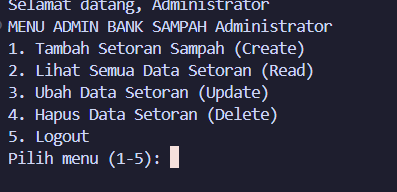
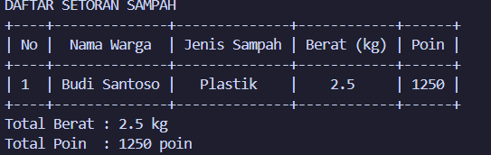
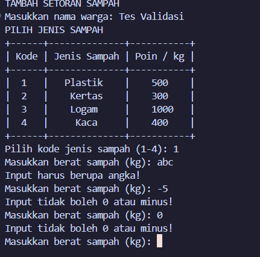

# Minpro-2-DDP-ManajemenBankSampah

---

### Informasi Pengembang
- **Nama** : M. Fairuz Firerza Aliushami
- **NIM** : 2609116062
- **Praktikum** : Dasar-Dasar Pemrograman (DDP)
- **Tugas** : Mini Project 2
- **File Program** : `main.py`
- **Bahasa Pemrograman** : Python 3.x

---

## Struktur Direktori Proyek

Struktur folder dan pengorganisasian berkas dalam repository ini ditata secara sistematis sebagai berikut:

```text
Minpro-2-DDP-ManajemenBankSampah/
│
├── main.py                    # File utama program Python
├── README.md                  # Dokumentasi utama proyek
│
└── assets/                    # Folder khusus untuk seluruh media & gambar
    ├── flowchart.png          # Gambar diagram alur program (flowchart)
    │
    └── screenshot/           # Folder khusus hasil tangkapan layar (screenshot)
        ├── 01-login.png       # Screenshot tampilan login (pwinput)
        ├── 02-menu-admin.png  # Screenshot tampilan menu admin
        ├── 03-menu-user.png   # Screenshot tampilan menu user/nasabah
        ├── 04-tabel-crud.png  # Screenshot output tabel PrettyTable
        └── 05-validasi.png    # Screenshot respon validasi error / angka minus
```

---

## Daftar Isi
1. [Struktur Direktori Proyek](#struktur-direktori-proyek)
2. [Deskripsi Singkat Program](#deskripsi-singkat-program)
3. [Pembaruan Utama dari Mini Project 1](#pembaruan-utama-dari-mini-project-1)
4. [Alur Program & Flowchart](#alur-program--flowchart)
5. [Dokumentasi Fitur & Potongan Kode](#dokumentasi-fitur--potongan-kode)
   - [1. Fitur Autentikasi & Login Multi-Role](#1-fitur-autentikasi--login-multi-role)
   - [2. Sistem Multi-Role & Dashboard Menu](#2-sistem-multi-role--dashboard-menu)
   - [3. Manajemen Setoran Sampah (Operasi CRUD)](#3-manajemen-setoran-sampah-operasi-crud)
   - [4. Validasi Input Anti-Minus & Error Handling](#4-validasi-input-anti-minus--error-handling)
6. [Penjelasan Nilai Tambah & Library](#penjelasan-nilai-tambah--library)
7. [Daftar Akun Pengguna Default](#daftar-akun-pengguna-default)

---

## Deskripsi Singkat Program

**Minpro-2-DDP-ManajemenBankSampah** adalah aplikasi antarmuka baris perintah (*Command Line Interface* / CLI) yang dirancang untuk mengotomatisasi pencatatan setoran sampah daur ulang dari warga/nasabah, menghitung perolehan poin ramah lingkungan secara langsung, dan mengelola rekapitulasi data secara akurat.

Program ini membedakan peran antara **Administrator** dan **Nasabah (Warga)**:
- **Administrator** memiliki hak penuh untuk menambah setoran atas nama warga mana pun, melihat rekapitulasi seluruh nasabah, serta mengubah (*update*) maupun menghapus (*delete*) data setoran.
- **Nasabah (Warga)** hanya dapat menyetorkan sampah atas nama akunnya sendiri, melihat riwayat mutasi tabungan sampahnya sendiri, dan melihat katalog tarif poin per kilogram jenis sampah.

---

## Pembaruan Utama dari Mini Project 1

Pada Mini Project 2 ini, arsitektur kode pada `main.py` mengalami peningkatan yang signifikan dibandingkan implementasi sebelumnya:

| Aspek Pembaruan | Mini Project 1 | Mini Project 2 (`main.py`) | Manfaat / Signifikansi |
| :--- | :--- | :--- | :--- |
| **Struktur Data Akun & Tarif** | Variabel terpisah / Tuple statis | **Dictionary Bersekat (`dict`)** | Akses data berbasis *key-value* cepat, terstruktur, dan mudah diekspansi (`USERS`, `HARGA_SAMPAH`). |
| **Dekomposisi Kode** | Alur skrip sekuensial linear | **Modularitas Fungsi (`def`)** | Menerapkan prinsip *Clean Code* & DRY (*Don't Repeat Yourself*). |
| **Sistem Autentikasi** | Tanpa autentikasi (publik langsung) | **Login Multi-Role Terproteksi** | Memisahkan hak akses antara Administrator dan Nasabah/Warga. |
| **Keamanan Input Kredensial** | Input teks biasa (`input()`) | **Masking Password (`pwinput`)** | Password disamarkan dengan karakter bintang (`*`) di terminal. |
| **Penyajian Data Tabel** | String formatting sederhana | **PrettyTable ASCII Generator** | Tampilan visual data tabular jauh lebih rapi, terstruktur, dan dinamis. |
| **Validasi & Integritas Data** | Rentan crash jika salah tipe | **Error Handling (`try-except`) & Anti-Minus** | Melindungi sistem dari input non-angka dan nilai negatif/nol. |

---

## Alur Program & Flowchart

### 1. Gambar Flowchart Program
Dokumentasi visual bagan alur resmi program dapat dilihat pada file gambar berikut:


### 2. Penjelasan Runtut Alur Logika Program
1. **Inisialisasi & Login**:
   - Program membersihkan layar terminal (`hapus_layar()`) dan menyajikan header `LOGIN SISTEM BANK SAMPAH`.
   - Pengguna memasukkan `username` dan `password` (karakter password disembunyikan menggunakan modul `pwinput`).
2. **Pengecekan Kredensial & Role**:
   - Dictionary `USERS` dicocokkan. Apabila username atau password tidak sesuai, program memberikan peringatan `Username atau Password salah!` dan mengulang proses login.
   - Jika kredensial cocok, sistem mengembalikan tuple `(username, role, nama)` untuk menyapa pengguna dan menentukan dashboard menu.
3. **Penyajian Dashboard Sesuai Role**:
   - **Role Admin (`menu_admin`)**: Memiliki akses ke 5 menu:
     1. *Tambah Setoran Sampah (Create)*: Admin dapat menginput nama warga mana pun (`pemilik = "admin"`).
     2. *Lihat Semua Data Setoran (Read)*: Menampilkan seluruh baris setoran di `data_setoran` tanpa filter, lengkap dengan total berat dan total poin.
     3. *Ubah Data Setoran (Update)*: Memilih nomor data untuk memperbarui nama warga, opsi ubah jenis sampah, serta opsi ubah berat sampah dengan kalkulasi ulang poin otomatis.
     4. *Hapus Data Setoran (Delete)*: Menghapus data spesifik berdasarkan nomor urut baris.
     5. *Logout*: Menampilkan konfirmasi `Logout berhasil.` dan kembali ke halaman login.
   - **Role User / Nasabah (`menu_user`)**: Memiliki akses ke 4 menu:
     1. *Tambah Setoran Saya*: Nama warga terkunci otomatis sesuai nama akun login (`pemilik = username_login`).
     2. *Lihat Riwayat Setoran Saya*: Memanggil `lihat_setoran(username)` sehingga data difilter khusus transaksi nasabah yang sedang aktif.
     3. *Lihat Daftar Poin Sampah*: Menampilkan katalog `PrettyTable` jenis sampah dan tarif poin per kilogram.
     4. *Logout*: Menampilkan konfirmasi `Logout berhasil.` dan kembali ke halaman login.
4. **Validasi Input Terintegrasi**:
   - Input nilai desimal berat sampah diverifikasi oleh `input_angka_positif()`.
   - Input nomor baris urutan pada update dan delete diverifikasi oleh `input_int_positif()`.
   - Keduanya mencegah nilai `0`, nilai negatif, serta kesalahan ketik huruf/simbol dengan *exception handling*.

---

## Dokumentasi Fitur & Potongan Kode

Struktur kode di bawah ini diambil persis dari file implementasi [`main.py`](main.py):

### 1. Fitur Autentikasi & Login Multi-Role

Fungsi `login()` bertugas menyaring akses masuk ke sistem. Demi melindungi privasi pengguna dari intipan layar (*shoulder surfing*), modul `pwinput.pwinput()` digunakan untuk menyamarkan input kata sandi.

```python
def login():
    hapus_layar()
    print("LOGIN SISTEM BANK SAMPAH")
    
    username = input("Masukkan Username : ")
    password = pwinput.pwinput("Masukkan Password : ")

    if username in USERS and USERS[username]["password"] == password:
        return username, USERS[username]["role"], USERS[username]["nama"]
    else:
        print("Username atau Password salah!")
        input("Tekan Enter untuk mencoba lagi...")
        return None, None, None
```

> **Dokumentasi Output Tampilan Login:**  
> 

---

### 2. Sistem Multi-Role & Dashboard Menu

Sistem memisahkan alur kerja melalui fungsi `menu_admin()` dan `menu_user()` berdasarkan parameter role yang dikembalikan oleh fungsi `login()`.

#### A. Dashboard Administrator (`menu_admin`)
```python
def menu_admin(username, nama):
    while True:
        print("MENU ADMIN BANK SAMPAH", nama)
        print("1. Tambah Setoran Sampah (Create)")
        print("2. Lihat Semua Data Setoran (Read)")
        print("3. Ubah Data Setoran (Update)")
        print("4. Hapus Data Setoran (Delete)")
        print("5. Logout")
        
        pilihan = input("Pilih menu (1-5): ")
        hapus_layar()
        
        if pilihan == "1":
            tambah_setoran(username, True)
        elif pilihan == "2":
            lihat_setoran()
        elif pilihan == "3":
            ubah_setoran()
        elif pilihan == "4":
            hapus_setoran()
        elif pilihan == "5":
            print("Logout berhasil.")
            break
        else:
            print("Pilihan menu tidak valid!")
```

> **Dokumentasi Output Menu Admin:**  
> 

#### B. Dashboard Nasabah / Warga (`menu_user`)
```python
def menu_user(username, nama):
    while True:
        print("NASABAH / WARGA -", nama)
        print("1. Tambah Setoran Saya")
        print("2. Lihat Riwayat Setoran Saya")
        print("3. Lihat Daftar Poin Sampah")
        print("4. Logout")
        
        pilihan = input("Pilih menu (1-4): ")
        hapus_layar()
        
        if pilihan == "1":
            tambah_setoran(username, False)
        elif pilihan == "2":
            lihat_setoran(username)
        elif pilihan == "3":
            pilih_jenis_sampah()
        elif pilihan == "4":
            print("Logout berhasil.")
            break
        else:
            print("Pilihan menu tidak valid!")
```

> **Dokumentasi Output Menu Nasabah:**  
> 

---

### 3. Manajemen Setoran Sampah (Operasi CRUD)

Manajemen data transaksi setoran sampah pada `main.py` mengimplementasikan empat pilar utama pengolahan data:

#### A. Create (`tambah_setoran`)
Menambahkan data transaksi setoran ke dalam list koleksi `data_setoran`. Sistem mengecek parameter `is_admin` untuk menentukan apakah nama warga diinput bebas atau dikunci otomatis sesuai akun nasabah login.

```python
def tambah_setoran(username_login, is_admin):
    print("TAMBAH SETORAN SAMPAH")
    if is_admin:
        nama_warga = input("Masukkan nama warga: ")
        if nama_warga == "":
            print("Nama tidak boleh kosong!")
            return
        pemilik = "admin"
    else:
        nama_warga = USERS[username_login]["nama"]
        pemilik = username_login
        print("Nama Nasabah:", nama_warga)

    jenis_nama, poin_rate = pilih_jenis_sampah()
    berat = input_angka_positif("Masukkan berat sampah (kg): ")
    poin_didapat = int(berat * poin_rate)

    data_baru = {
        "nama": nama_warga,
        "jenis": jenis_nama,
        "berat": berat,
        "poin": poin_didapat,
        "user": pemilik
    }
    data_setoran.append(data_baru)
    print("Data setoran berhasil ditambahkan!")
```

#### B. Read (`lihat_setoran`)
Membaca dan menampilkan isi data setoran dalam format tabel `PrettyTable`. Fungsi ini mendukung penyaringan otomatis: jika dipanggil dengan argumen `username_filter`, hanya transaksi milik pengguna tersebut yang ditampilkan; jika tanpa filter (`None`), seluruh data transaksi setoran akan disajikan.

```python
def lihat_setoran(username_filter=None):
    print("DAFTAR SETORAN SAMPAH")
    
    list_tampil = []
    if username_filter != None:
        for item in data_setoran:
            if item["user"] == username_filter:
                list_tampil.append(item)
    else:
        list_tampil = data_setoran

    if len(list_tampil) == 0:
        print("Belum ada data setoran.")
        return False

    tabel = PrettyTable()
    tabel.field_names = ["No", "Nama Warga", "Jenis Sampah", "Berat (kg)", "Poin"]
    
    total_berat = 0
    total_poin = 0
    nomor = 1

    for item in list_tampil:
        tabel.add_row([nomor, item["nama"], item["jenis"], item["berat"], item["poin"]])
        total_berat = total_berat + item["berat"]
        total_poin = total_poin + item["poin"]
        nomor = nomor + 1

    print(tabel)
    print("Total Berat :", total_berat, "kg")
    print("Total Poin  :", total_poin, "poin")
    return True
```

**Simulasi Output Tampilan Tabel:**
```text
DAFTAR SETORAN SAMPAH
+----+--------------+--------------+------------+------+
| No |  Nama Warga  | Jenis Sampah | Berat (kg) | Poin |
+----+--------------+--------------+------------+------+
| 1  | Budi Santoso |   Plastik    |    2.5     | 1250 |
+----+--------------+--------------+------------+------+
Total Berat : 2.5 kg
Total Poin  : 1250 poin
```

> **Dokumentasi Output Tampilan Tabel PrettyTable:**  
> 

#### C. Update (`ubah_setoran`)
Admin dapat memperbarui rincian transaksi data setoran (nama, konfirmasi ubah jenis sampah, dan konfirmasi ubah berat sampah) dengan kalkulasi ulang poin otomatis sesuai tarif yang berlaku di `HARGA_SAMPAH`.

```python
def ubah_setoran():
    if lihat_setoran() == False:
        return

    print("UBAH DATA SETORAN")
    nomor_input = input_int_positif("Masukkan nomor data yang ingin diubah: ")
    index = nomor_input - 1

    if index >= 0 and index < len(data_setoran):
        item = data_setoran[index]
        print("Mengubah data milik:", item["nama"])
        
        nama_baru = input("Masukkan nama baru (tekan Enter jika tidak diubah): ")
        if nama_baru != "":
            item["nama"] = nama_baru

        pilih_ubah_jenis = input("Ubah jenis sampah? (y/n): ")
        if pilih_ubah_jenis == "y":
            jenis_baru, poin_rate = pilih_jenis_sampah()
            item["jenis"] = jenis_baru
        else:
            poin_rate = 500
            for k in HARGA_SAMPAH:
                if HARGA_SAMPAH[k]["nama"] == item["jenis"]:
                    poin_rate = HARGA_SAMPAH[k]["poin_per_kg"]

        pilih_ubah_berat = input("Ubah berat sampah? (y/n): ")
        if pilih_ubah_berat == "y":
            item["berat"] = input_angka_positif("Masukkan berat baru (kg): ")

        item["poin"] = int(item["berat"] * poin_rate)
        print("Data berhasil diperbarui!")
    else:
        print("Nomor data tidak ditemukan!")
```

#### D. Delete (`hapus_setoran`)
Admin dapat menghapus baris transaksi sampah dari memori menggunakan instruksi `del` berdasarkan verifikasi indeks data yang valid.

```python
def hapus_setoran():
    if lihat_setoran() == False:
        return

    print("HAPUS DATA SETORAN")
    nomor_input = input_int_positif("Masukkan nomor data yang ingin dihapus: ")
    index = nomor_input - 1

    if index >= 0 and index < len(data_setoran):
        nama_terhapus = data_setoran[index]["nama"]
        del data_setoran[index]
        print("Data milik", nama_terhapus, "berhasil dihapus!")
    else:
        print("Nomor data tidak ditemukan!")
```

---

### 4. Validasi Input Anti-Minus & Error Handling

Untuk memastikan data kuantitatif selalu valid dan melindungi program dari error input yang tidak diharapkan, `main.py` menyediakan dua fungsi pengamanan:

#### A. Input Nilai Desimal Positif (`input_angka_positif`)
```python
def input_angka_positif(pesan):
    while True:
        try:
            nilai = float(input(pesan))
            if nilai <= 0:
                print("Input tidak boleh 0 atau minus!")
            else:
                return nilai
        except ValueError:
            print("Input harus berupa angka!")
```

#### B. Input Nilai Bilangan Bulat Positif (`input_int_positif`)
```python
def input_int_positif(pesan):
    while True:
        try:
            nilai = int(input(pesan))
            if nilai <= 0:
                print("Angka harus lebih dari 0!")
            else:
                return nilai
        except ValueError:
            print("Input harus berupa angka bulat!")
```

**Mekanisme Pengamanan:**
1. **Blok `try-except ValueError`**: Mengantisipasi kesalahan ketik ketika pengguna memasukkan karakter huruf, simbol, atau input kosong pada prompt numerik. Program menangkap pengecualian tersebut dan menampilkan pesan peringatan tanpa menghentikan program (*anti-crash*).
2. **Filter Logika `nilai <= 0`**: Memastikan bobot sampah serta nomor indeks data yang diinput selalu bernilai positif murni (> 0), mencegah anomali data bernilai minus atau nol.

> **Dokumentasi Output Respons Validasi Error & Anti-Minus:**  
> 

---

## Penjelasan Nilai Tambah & Library

### 1. Robustness Melalui Exception Handling (`try-except`)
Penggunaan struktur penanganan eksepsi `try-except` pada fungsi input numerik memberikan jaminan stabilitas (*fault tolerance*). Program tidak akan mengalami *runtime exception* atau *traceback crash* ketika pengguna memasukkan karakter alfabetis atau simbol tak valid. Program secara otomatis meminta input ulang sampai nilai yang sah diberikan.

### 2. Peran 3 Library Utama Python

| Nama Library | Kategori | Peran & Implementasi dalam Kode (`main.py`) |
| :--- | :--- | :--- |
| **`os`** | Standard Library Python | Mengatur manipulasi sistem operasi dengan memanggil perintah `cls` (pada Windows / NT) atau `clear` (pada sistem POSIX seperti Linux dan macOS) melalui fungsi pembantu `hapus_layar()`. Hal ini menjaga tampilan antarmuka CLI tetap bersih dan terfokus pada setiap pergantian menu. |
| **`pwinput`** | External Library | Menyediakan fungsi `pwinput.pwinput()` pada proses login pengguna. Berbeda dengan fungsi bawaan `input()` yang menampilkan teks mentah secara terbuka di layar terminal, `pwinput` menggantikan karakter sandi dengan tanda bintang (`*`), mencegah kebocoran informasi kredensial (*credential leak*). |
| **`prettytable`** | External Library | Menyediakan kelas `PrettyTable` untuk menyusun data koleksi list dan dictionary menjadi tabel bergaya ASCII. Digunakan pada fungsi `pilih_jenis_sampah()` untuk menampilkan katalog harga dan pada `lihat_setoran()` untuk menampilkan rekapitulasi data setoran yang simetris dan mudah dibaca. |

---

## Daftar Akun Pengguna Default

Sistem pada `main.py` telah dilengkapi dua akun bawaan dalam dictionary `USERS` untuk memfasilitasi pengujian multi-role:

| Role Pengguna | Username | Password | Nama Lengkap | Lingkup Hak Akses |
| :--- | :--- | :--- | :--- | :--- |
| **Administrator** | `admin` | `admin123` | Administrator | Akses penuh CRUD, pencatatan setoran atas nama warga bebas, melihat seluruh data nasabah tanpa filter, mengubah rincian setoran, serta menghapus data transaksi. |
| **Nasabah / Warga** | `budi` | `123` | Budi Santoso | Akses terbatas nasabah: hanya dapat mencatat setoran atas nama akun sendiri, melihat mutasi riwayat setoran pribadi, dan melihat katalog tarif poin sampah. |

---

*Dikembangkan dengan dedikasi untuk Tugas Praktikum Dasar-Dasar Pemrograman (DDP).*
