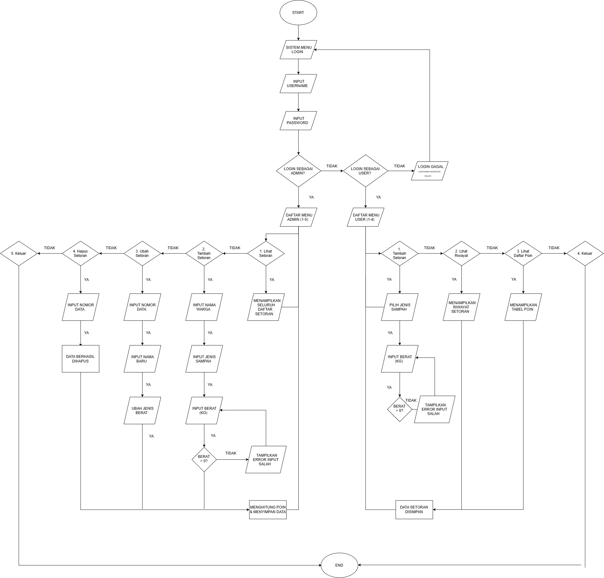
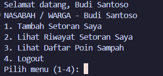

# Minpro-2-DDP-ManajemenBankSampah

> **Sistem Manajemen Bank Sampah Berbasis CLI Python dengan Autentikasi Multi-Role, Manajemen CRUD Terstruktur, dan Validasi Data Terproteksi.**

---

### Informasi Pengembang
- **Nama** : M. Fairuz Firerza Aliushami
- **NIM** : 2609116062
- **Mata Kuliah** : Dasar-Dasar Pemrograman (DDP)
- **Tugas** : Mini Project 2
- **File Program** : `main.py`

---

## Struktur Direktori Proyek

Struktur folder dan pengorganisasian berkas dalam repository ini ditata secara sistematis sebagai berikut:

```text
Minpro-2-DDP-ManajemenBankSampah/
│
├── main.py                    # File utama program Python
├── README.md                  # Dokumentasi utama proyek
│
└── assets/                    # Folder khusus untuk seluruh media & gambar
    ├── flowchart.png          # Gambar diagram alur program (flowchart)
    │
    └── screenshots/           # Folder khusus hasil tangkapan layar (screenshot)
        ├── 01-login.png       # Screenshot tampilan login (pwinput)
        ├── 02-menu-admin.png  # Screenshot tampilan menu admin
        ├── 03-menu-user.png   # Screenshot tampilan menu user/nasabah
        ├── 04-tabel-crud.png  # Screenshot output tabel PrettyTable
        └── 05-validasi.png    # Screenshot respon validasi error / angka minus
```

---

## Daftar Isi
1. [Struktur Direktori Proyek](#struktur-direktori-proyek)
2. [Deskripsi Singkat Program](#deskripsi-singkat-program)
3. [Pembaruan Utama dari Mini Project 1](#pembaruan-utama-dari-mini-project-1)
4. [Alur Program & Flowchart](#alur-program--flowchart)
5. [Bedah Kode Lengkap & Penjelasan Baris per Baris](#bedah-kode-lengkap--penjelasan-baris-per-baris)
   - [5.1 Modul & Library Eksternal](#51-modul--library-eksternal)
   - [5.2 Struktur Data Global (Basis Data In-Memory)](#52-struktur-data-global-basis-data-in-memory)
   - [5.3 Fungsi Utilitas Pembersihan Layar](#53-fungsi-utilitas-pembersihan-layar-hapus_layar)
   - [5.4 Fungsi Validasi Input Numerik & Anti-Minus](#54-fungsi-validasi-input-numerik--anti-minus)
   - [5.5 Fungsi Katalog & Pemilihan Jenis Sampah](#55-fungsi-katalog--pemilihan-jenis-sampah-pilih_jenis_sampah)
   - [5.6 Fitur Autentikasi Pengguna (`login`)](#56-fitur-autentikasi-pengguna-login)
   - [5.7 Operasi Manajemen Data Setoran (CRUD)](#57-operasi-manajemen-data-setoran-crud)
     - [A. Tambah Setoran (`Create`)](#a-tambah-setoran-create)
     - [B. Lihat Riwayat Setoran (`Read`)](#b-lihat-riwayat-setoran-read)
     - [C. Ubah Data Setoran (`Update`)](#c-ubah-data-setoran-update)
     - [D. Hapus Data Setoran (`Delete`)](#d-hapus-data-setoran-delete)
   - [5.8 Navigasi Menu Dashboard Multi-Role](#58-navigasi-menu-dashboard-multi-role)
     - [A. Menu Administrator (`menu_admin`)](#a-menu-administrator-menu_admin)
     - [B. Menu Nasabah / Warga (`menu_user`)](#b-menu-nasabah--warga-menu_user)
   - [5.9 Fungsi Pengendali Utama (`main`)](#59-fungsi-pengendali-utama-main)
6. [Penjelasan Nilai Tambah & Library](#penjelasan-nilai-tambah--library)
7. [Daftar Akun Pengguna Default](#daftar-akun-pengguna-default)

---

## Deskripsi Singkat Program

**Minpro-2-DDP-ManajemenBankSampah** adalah aplikasi antarmuka baris perintah (*Command Line Interface* / CLI) yang dirancang untuk mengotomatisasi pencatatan setoran sampah daur ulang dari warga/nasabah, menghitung perolehan poin ramah lingkungan secara langsung, dan mengelola rekapitulasi data secara akurat.

Program ini membedakan peran antara **Administrator** dan **Nasabah (Warga)**:
- **Administrator** memiliki hak penuh untuk menambah setoran atas nama warga mana pun, melihat rekapitulasi seluruh nasabah, serta mengubah (*update*) maupun menghapus (*delete*) data setoran.
- **Nasabah (Warga)** hanya dapat menyetorkan sampah atas nama akunnya sendiri, melihat riwayat mutasi tabungan sampahnya sendiri, dan melihat katalog tarif poin per kilogram jenis sampah.

---

## Pembaruan Utama dari Mini Project 1

Pada Mini Project 2 ini, arsitektur kode pada `main.py` mengalami peningkatan yang signifikan dibandingkan implementasi sebelumnya:

| Aspek Pembaruan | Mini Project 1 | Mini Project 2 (`main.py`) | Manfaat / Signifikansi |
| :--- | :--- | :--- | :--- |
| **Struktur Data Akun & Tarif** | Variabel terpisah / Tuple statis | **Dictionary Bersekat (`dict`)** | Akses data berbasis *key-value* cepat, terstruktur, dan mudah diekspansi (`USERS`, `HARGA_SAMPAH`). |
| **Dekomposisi Kode** | Alur skrip sekuensial linear | **Modularitas Fungsi (`def`)** | Menerapkan prinsip *Clean Code* & DRY (*Don't Repeat Yourself*). |
| **Sistem Autentikasi** | Tanpa autentikasi (publik langsung) | **Login Multi-Role Terproteksi** | Memisahkan hak akses antara Administrator dan Nasabah/Warga. |
| **Keamanan Input Kredensial** | Input teks biasa (`input()`) | **Masking Password (`pwinput`)** | Password disamarkan dengan karakter bintang (`*`) di terminal. |
| **Penyajian Data Tabel** | String formatting sederhana | **PrettyTable ASCII Generator** | Tampilan visual data tabular jauh lebih rapi, terstruktur, dan dinamis. |
| **Validasi & Integritas Data** | Rentan crash jika salah tipe | **Error Handling (`try-except`) & Anti-Minus** | Melindungi sistem dari input non-angka dan nilai negatif/nol. |

---

## Alur Program & Flowchart

### 1. Gambar Flowchart Program
Dokumentasi visual bagan alur resmi program dapat dilihat pada file gambar berikut:



### 2. Penjelasan Runtut Alur Logika Program
1. **Inisialisasi & Login**:
   - Program membersihkan layar terminal (`hapus_layar()`) dan menyajikan header `LOGIN SISTEM BANK SAMPAH`.
   - Pengguna memasukkan `username` dan `password` (karakter password disembunyikan menggunakan modul `pwinput`).
2. **Pengecekan Kredensial & Role**:
   - Dictionary `USERS` dicocokkan. Apabila username atau password tidak sesuai, program memberikan peringatan `Username atau Password salah!` dan mengulang proses login.
   - Jika kredensial cocok, sistem mengembalikan tuple `(username, role, nama)` untuk menyapa pengguna dan menentukan dashboard menu.
3. **Penyajian Dashboard Sesuai Role**:
   - **Role Admin (`menu_admin`)**: Memiliki akses ke 5 menu:
     1. *Tambah Setoran Sampah (Create)*: Admin dapat menginput nama warga mana pun (`pemilik = "admin"`).
     2. *Lihat Semua Data Setoran (Read)*: Menampilkan seluruh baris setoran di `data_setoran` tanpa filter, lengkap dengan total berat dan total poin.
     3. *Ubah Data Setoran (Update)*: Memilih nomor data untuk memperbarui nama warga, opsi ubah jenis sampah, serta opsi ubah berat sampah dengan kalkulasi ulang poin otomatis.
     4. *Hapus Data Setoran (Delete)*: Menghapus data spesifik berdasarkan nomor urut baris.
     5. *Logout*: Menampilkan konfirmasi `Logout berhasil.` dan kembali ke halaman login.
   - **Role User / Nasabah (`menu_user`)**: Memiliki akses ke 4 menu:
     1. *Tambah Setoran Saya*: Nama warga terkunci otomatis sesuai nama akun login (`pemilik = username_login`).
     2. *Lihat Riwayat Setoran Saya*: Memanggil `lihat_setoran(username)` sehingga data difilter khusus transaksi nasabah yang sedang aktif.
     3. *Lihat Daftar Poin Sampah*: Menampilkan katalog `PrettyTable` jenis sampah dan tarif poin per kilogram.
     4. *Logout*: Menampilkan konfirmasi `Logout berhasil.` dan kembali ke halaman login.
4. **Validasi Input Terintegrasi**:
   - Input nilai desimal berat sampah diverifikasi oleh `input_angka_positif()`.
   - Input nomor baris urutan pada update dan delete diverifikasi oleh `input_int_positif()`.
   - Keduanya mencegah nilai `0`, nilai negatif, serta kesalahan ketik huruf/simbol dengan *exception handling*.

---

## Bedah Kode Lengkap & Penjelasan Baris per Baris

Bagian ini menyajikan seluruh potongan kode sumber yang digunakan pada program beserta analisis fungsi dan logika kerjanya secara mendetail.

### 5.1 Modul & Library Eksternal

```python
import os
import pwinput
from prettytable import PrettyTable
```

**Penjelasan Kode:**
- `import os`: Mengimpor modul bawaan Python (*standard library*) untuk berinteraksi dengan sistem operasi komputer tuan rumah, khususnya untuk mengeksekusi instruksi pembersihan layar konsol.
- `import pwinput`: Mengimpor library pihak ketiga yang bertindak serupa fungsi `input()`, namun menyembunyikan karakter teks yang diketikkan pengguna dengan karakter visual bintang (`*`).
- `from prettytable import PrettyTable`: Mengimpor kelas `PrettyTable` untuk merender struktur data matriks (baris dan kolom) menjadi tabel grafis berbasis ASCII di terminal.

---

### 5.2 Struktur Data Global (Basis Data In-Memory)

Program mengandalkan tiga variabel global untuk menyimpan entitas data secara dinamis dalam memori kerja (*RAM*):

```python
USERS = {
    "admin": {"password": "admin123", "role": "admin", "nama": "Administrator"},
    "budi": {"password": "123", "role": "user", "nama": "Budi Santoso"}
}

HARGA_SAMPAH = {
    "1": {"nama": "Plastik", "poin_per_kg": 500},
    "2": {"nama": "Kertas", "poin_per_kg": 300},
    "3": {"nama": "Logam", "poin_per_kg": 1000},
    "4": {"nama": "Kaca", "poin_per_kg": 400}
}

data_setoran = [
    {"nama": "Budi Santoso", "jenis": "Plastik", "berat": 2.5, "poin": 1250, "user": "budi"}
]
```

**Penjelasan Struktur Data:**
1. **`USERS` (Nested Dictionary)**:
   - Kunci terluar (*key*) merupakan `username` unik akun.
   - Nilai (*value*) berupa dictionary bertingkat yang menyimpan atribut pengguna:
     - `password`: String kata sandi autentikasi.
     - `role`: Hak akses otorisasi (`admin` untuk pengurus, `user` untuk nasabah).
     - `nama`: Nama lengkap pemilik akun untuk keperluan sapaan personal.
2. **`HARGA_SAMPAH` (Nested Dictionary)**:
   - Kunci berupa string numerik (`"1"` hingga `"4"`) yang mewakili kode pilihan menu.
   - Menyimpan atribut jenis sampah (`nama`) dan nilai tukar poin per kilogram (`poin_per_kg`).
3. **`data_setoran` (List of Dictionaries)**:
   - Berfungsi sebagai tabel utama transaksi setoran.
   - Menggunakan tipe `list` yang bersifat *mutable* (dapat ditambah, diubah, dan dihapus).
   - Setiap elemen di dalamnya merepresentasikan satu dokumen transaksi dengan atribut: `nama` (nama warga), `jenis` (kategori sampah), `berat` (kuantitas dalam kg), `poin` (total poin didapat), dan `user` (identitas penyetor / hak kepemilikan data).

---

### 5.3 Fungsi Utilitas Pembersihan Layar (`hapus_layar`)

```python
def hapus_layar():
    os.system('cls' if os.name == 'nt' else 'clear')
```

**Penjelasan Logika:**
- Fungsi ini mengimplementasikan ekspresi ternary:
  - Jika `os.name == 'nt'` (lingkungan Windows), maka fungsi memanggil perintah `os.system('cls')`.
  - Jika selain Windows (Linux/macOS yang berbasis POSIX), fungsi memanggil `os.system('clear')`.
- Tujuannya adalah memastikan terminal selalu rapi dan bersih saat berganti halaman menu, memberikan pengalaman antarmuka (*User Experience*) yang profesional di berbagai sistem operasi.

---

### 5.4 Fungsi Validasi Input Numerik & Anti-Minus

Untuk menjamin keabsahan data kuantitatif, program menggunakan dua fungsi validasi perulangan tak hingga (`while True`) dengan blok proteksi `try-except`:

#### A. Input Nilai Desimal Positif (`input_angka_positif`)
```python
def input_angka_positif(pesan):
    while True:
        try:
            nilai = float(input(pesan))
            if nilai <= 0:
                print("Input tidak boleh 0 atau minus!")
            else:
                return nilai
        except ValueError:
            print("Input harus berupa angka!")
```

**Penjelasan Logika:**
1. `while True`: Membuka perulangan yang hanya akan berhenti (`return`) apabila pengguna telah menginput data yang sepenuhnya valid.
2. `float(input(pesan))`: Berusaha mengonversi teks input menjadi bilangan riil/desimal (misalnya: `2.5`).
3. `except ValueError`: Jika konversi gagal karena pengguna mengetik huruf atau simbol (misal `abc`), alur dialihkan ke blok ini, mencetak pesan peringatan, dan meminta input ulang tanpa membuat program berhenti (*crash*).
4. `if nilai <= 0`: Mengevaluasi apakah angka bernilai nol atau minus. Jika ya, nilai ditolak dengan pesan `Input tidak boleh 0 atau minus!`.
5. `return nilai`: Mengembalikan nilai angka yang telah lolos seluruh tahapan verifikasi.

#### B. Input Nilai Bilangan Bulat Positif (`input_int_positif`)
```python
def input_int_positif(pesan):
    while True:
        try:
            nilai = int(input(pesan))
            if nilai <= 0:
                print("Angka harus lebih dari 0!")
            else:
                return nilai
        except ValueError:
            print("Input harus berupa angka bulat!")
```

**Penjelasan Logika:**
- Mirip dengan `input_angka_positif()`, fungsi ini digunakan khusus untuk nomor urutan baris data pada proses pengubahan (*Update*) dan penghapusan (*Delete*). Nilai dikonversi menggunakan fungsi `int()` dan menolak input desimal maupun karakter non-angka.

> **Dokumentasi Output Respons Validasi Error & Anti-Minus:**  
> 

---

### 5.5 Fungsi Katalog & Pemilihan Jenis Sampah (`pilih_jenis_sampah`)

```python
def pilih_jenis_sampah():
    print("PILIH JENIS SAMPAH")
    tabel = PrettyTable()
    tabel.field_names = ["Kode", "Jenis Sampah", "Poin / kg"]
    for kode in HARGA_SAMPAH:
        tabel.add_row([kode, HARGA_SAMPAH[kode]["nama"], HARGA_SAMPAH[kode]["poin_per_kg"]])
    print(tabel)
    while True:
        pilihan = input("Pilih kode jenis sampah (1-4): ")
        if pilihan in HARGA_SAMPAH:
            return HARGA_SAMPAH[pilihan]["nama"], HARGA_SAMPAH[pilihan]["poin_per_kg"]
        print("Pilihan tidak valid, pilih 1-4!")
```

**Penjelasan Logika:**
1. Menginisialisasi objek tabel dengan header kolom `["Kode", "Jenis Sampah", "Poin / kg"]`.
2. Melakukan iterasi terhadap kunci dictionary `HARGA_SAMPAH` menggunakan `for kode in HARGA_SAMPAH:`, menambahkan setiap baris ke tabel, lalu mencetaknya.
3. Melakukan validasi input pilihan dengan klausa `if pilihan in HARGA_SAMPAH:`.
4. Jika pilihan sesuai (antara `"1"` sampai `"4"`), fungsi mengembalikan pasangan nilai (*tuple packing*) berupa nama jenis sampah dan tarif poin per kilogramnya: `return HARGA_SAMPAH[pilihan]["nama"], HARGA_SAMPAH[pilihan]["poin_per_kg"]`.

---

### 5.6 Fitur Autentikasi Pengguna (`login`)

```python
def login():
    hapus_layar()
    print("LOGIN SISTEM BANK SAMPAH")
    
    username = input("Masukkan Username : ")
    password = pwinput.pwinput("Masukkan Password : ")

    if username in USERS and USERS[username]["password"] == password:
        return username, USERS[username]["role"], USERS[username]["nama"]
    else:
        print("Username atau Password salah!")
        input("Tekan Enter untuk mencoba lagi...")
        return None, None, None
```

**Penjelasan Logika:**
1. Membersihkan layar konsol dan meminta input nama pengguna (`username`).
2. Meminta kata sandi dengan modul `pwinput.pwinput()` yang otomatis menyamarkan karakter masukan.
3. **Pengecekan Keamanan**:
   - `username in USERS`: Memeriksa keberadaan nama akun dalam dictionary.
   - `USERS[username]["password"] == password`: Memastikan kecocokan kata sandi.
4. Jika autentikasi sukses, fungsi mengembalikan nilai tuple `(username, role, nama)`.
5. Jika salah, program mencetak peringatan kesalahan, menahan tampilan dengan `input("Tekan Enter untuk mencoba lagi...")`, dan mengembalikan nilai `(None, None, None)` untuk memicu perulangan login kembali.

> **Dokumentasi Output Tampilan Login:**  
> 

---

### 5.7 Operasi Manajemen Data Setoran (CRUD)

Implementasi pengolahan data setoran sampah dibangun dengan modularitas penuh:

#### A. Tambah Setoran (`Create`)
```python
def tambah_setoran(username_login, is_admin):
    print("TAMBAH SETORAN SAMPAH")
    if is_admin:
        nama_warga = input("Masukkan nama warga: ")
        if nama_warga == "":
            print("Nama tidak boleh kosong!")
            return
        pemilik = "admin"
    else:
        nama_warga = USERS[username_login]["nama"]
        pemilik = username_login
        print("Nama Nasabah:", nama_warga)

    jenis_nama, poin_rate = pilih_jenis_sampah()
    berat = input_angka_positif("Masukkan berat sampah (kg): ")
    poin_didapat = int(berat * poin_rate)

    data_baru = {
        "nama": nama_warga,
        "jenis": jenis_nama,
        "berat": berat,
        "poin": poin_didapat,
        "user": pemilik
    }
    data_setoran.append(data_baru)
    print("Data setoran berhasil ditambahkan!")
```

**Penjelasan Logika:**
- **Pembedaan Hak Akses**:
  - Jika `is_admin == True`, admin memiliki hak memasukkan nama warga siapapun secara fleksibel dengan validasi string tidak boleh kosong. Field kepemilikan ditandai dengan `pemilik = "admin"`.
  - Jika `is_admin == False` (Nasabah), nama warga otomatis diambil dari profil login `USERS[username_login]["nama"]` dan kepemilikan ditandai dengan `username_login` untuk mencegah klaim data oleh akun lain.
- Memanggil `pilih_jenis_sampah()` untuk mendapatkan nama jenis sampah dan tarif poin.
- Memanggil `input_angka_positif()` untuk meminta nilai berat sampah yang terverifikasi.
- Menghitung poin: `poin_didapat = int(berat * poin_rate)`.
- Mengemas transaksi dalam bentuk dictionary `data_baru` lalu memasukkannya ke dalam list global dengan perintah `data_setoran.append(data_baru)`.

---

#### B. Lihat Riwayat Setoran (`Read`)
```python
def lihat_setoran(username_filter=None):
    print("DAFTAR SETORAN SAMPAH")
    
    list_tampil = []
    if username_filter != None:
        for item in data_setoran:
            if item["user"] == username_filter:
                list_tampil.append(item)
    else:
        list_tampil = data_setoran

    if len(list_tampil) == 0:
        print("Belum ada data setoran.")
        return False

    tabel = PrettyTable()
    tabel.field_names = ["No", "Nama Warga", "Jenis Sampah", "Berat (kg)", "Poin"]
    
    total_berat = 0
    total_poin = 0
    nomor = 1

    for item in list_tampil:
        tabel.add_row([nomor, item["nama"], item["jenis"], item["berat"], item["poin"]])
        total_berat = total_berat + item["berat"]
        total_poin = total_poin + item["poin"]
        nomor = nomor + 1

    print(tabel)
    print("Total Berat :", total_berat, "kg")
    print("Total Poin  :", total_poin, "poin")
    return True
```

**Penjelasan Logika:**
- **Mekanisme Filter**:
  - Parameter opsional `username_filter` bernilai default `None`.
  - Jika diisi (pada dashboard user), program menyaring data dengan membandingkan `item["user"] == username_filter`, sehingga nasabah hanya melihat transaksinya sendiri.
  - Jika `None` (pada dashboard admin), seluruh data di `data_setoran` ditampilkan.
- **Pengecekan Ketersediaan Data**: Jika `len(list_tampil) == 0`, program mencetak informasi `"Belum ada data setoran."` dan mengembalikan nilai boolean `False`.
- **Kalkulasi Akumulatif**: Program mengiterasi list data yang tampil, memasukkan baris ke dalam `PrettyTable`, serta mengakumulasikan `total_berat` dan `total_poin` untuk disajikan di bawah tabel.

**Simulasi Output Tampilan Tabel:**
```text
DAFTAR SETORAN SAMPAH
+----+--------------+--------------+------------+------+
| No |  Nama Warga  | Jenis Sampah | Berat (kg) | Poin |
+----+--------------+--------------+------------+------+
| 1  | Budi Santoso |   Plastik    |    2.5     | 1250 |
+----+--------------+--------------+------------+------+
Total Berat : 2.5 kg
Total Poin  : 1250 poin
```

> **Dokumentasi Output Tampilan Tabel PrettyTable:**  
> 

---

#### C. Ubah Data Setoran (`Update`)
```python
def ubah_setoran():
    if lihat_setoran() == False:
        return

    print("UBAH DATA SETORAN")
    nomor_input = input_int_positif("Masukkan nomor data yang ingin diubah: ")
    index = nomor_input - 1

    if index >= 0 and index < len(data_setoran):
        item = data_setoran[index]
        print("Mengubah data milik:", item["nama"])
        
        nama_baru = input("Masukkan nama baru (tekan Enter jika tidak diubah): ")
        if nama_baru != "":
            item["nama"] = nama_baru

        pilih_ubah_jenis = input("Ubah jenis sampah? (y/n): ")
        if pilih_ubah_jenis == "y":
            jenis_baru, poin_rate = pilih_jenis_sampah()
            item["jenis"] = jenis_baru
        else:
            poin_rate = 500
            for k in HARGA_SAMPAH:
                if HARGA_SAMPAH[k]["nama"] == item["jenis"]:
                    poin_rate = HARGA_SAMPAH[k]["poin_per_kg"]

        pilih_ubah_berat = input("Ubah berat sampah? (y/n): ")
        if pilih_ubah_berat == "y":
            item["berat"] = input_angka_positif("Masukkan berat baru (kg): ")

        item["poin"] = int(item["berat"] * poin_rate)
        print("Data berhasil diperbarui!")
    else:
        print("Nomor data tidak ditemukan!")
```

**Penjelasan Logika:**
1. Memeriksa ketersediaan data terlebih dahulu dengan `if lihat_setoran() == False: return`. Jika kosong, fungsi langsung dihentikan.
2. Meminta nomor urut baris data melalui `input_int_positif()`, kemudian mengonversinya ke sistem penomoran indeks Python (berbasis 0) melalui rumus: `index = nomor_input - 1`.
3. Memastikan indeks berada dalam rentang valid: `index >= 0 and index < len(data_setoran)`.
4. Menyediakan opsi pembaruan fleksibel:
   - **Nama**: Jika dikosongkan (langsung tekan Enter), nama lama dipertahankan.
   - **Jenis Sampah**: Jika pengguna memilih `'y'`, jenis baru dipilih dan `poin_rate` disesuaikan. Jika tidak diubah, program mencari rate poin yang sesuai dengan jenis sampah yang sedang aktif dari `HARGA_SAMPAH`.
   - **Berat Sampah**: Jika pengguna memilih `'y'`, berat baru diinput.
5. Menghitung kembali total poin secara otomatis berdasarkan berat dan tarif poin yang berlaku: `item["poin"] = int(item["berat"] * poin_rate)`.

---

#### D. Hapus Data Setoran (`Delete`)
```python
def hapus_setoran():
    if lihat_setoran() == False:
        return

    print("HAPUS DATA SETORAN")
    nomor_input = input_int_positif("Masukkan nomor data yang ingin dihapus: ")
    index = nomor_input - 1

    if index >= 0 and index < len(data_setoran):
        nama_terhapus = data_setoran[index]["nama"]
        del data_setoran[index]
        print("Data milik", nama_terhapus, "berhasil dihapus!")
    else:
        print("Nomor data tidak ditemukan!")
```

**Penjelasan Logika:**
1. Menampilkan seluruh data setoran dan membatalkan eksekusi jika data masih kosong.
2. Meminta nomor urutan baris data yang ingin dihapus.
3. Menghitung indeks list (`index = nomor_input - 1`).
4. Jika indeks valid, sistem menyimpan nama pemilik data ke variabel `nama_terhapus`, lalu menghapus item tersebut dari memori list menggunakan instruksi `del data_setoran[index]`.
5. Menampilkan konfirmasi keberhasilan penghapusan data.

---

### 5.8 Navigasi Menu Dashboard Multi-Role

Program menerapkan perulangan berbasis *event-loop* (`while True`) untuk menjaga agar menu terus aktif hingga pengguna memutuskan untuk logout.

#### A. Menu Administrator (`menu_admin`)
```python
def menu_admin(username, nama):
    while True:
        print("MENU ADMIN BANK SAMPAH", nama)
        print("1. Tambah Setoran Sampah (Create)")
        print("2. Lihat Semua Data Setoran (Read)")
        print("3. Ubah Data Setoran (Update)")
        print("4. Hapus Data Setoran (Delete)")
        print("5. Logout")
        
        pilihan = input("Pilih menu (1-5): ")
        hapus_layar()
        
        if pilihan == "1":
            tambah_setoran(username, True)
        elif pilihan == "2":
            lihat_setoran()
        elif pilihan == "3":
            ubah_setoran()
        elif pilihan == "4":
            hapus_setoran()
        elif pilihan == "5":
            print("Logout berhasil.")
            break
        else:
            print("Pilihan menu tidak valid!")
```

**Penjelasan Logika:**
- Menampilkan 5 pilihan kontrol CRUD penuh.
- Setiap pilihan dibersihkan layarnya terlebih dahulu dengan `hapus_layar()`.
- Opsi `5` memutus perulangan menu dengan pernyataan `break`, mengembalikan alur program ke siklus login utama.

> **Dokumentasi Output Menu Admin:**  
> 

---

#### B. Menu Nasabah / Warga (`menu_user`)
```python
def menu_user(username, nama):
    while True:
        print("NASABAH / WARGA -", nama)
        print("1. Tambah Setoran Saya")
        print("2. Lihat Riwayat Setoran Saya")
        print("3. Lihat Daftar Poin Sampah")
        print("4. Logout")
        
        pilihan = input("Pilih menu (1-4): ")
        hapus_layar()
        
        if pilihan == "1":
            tambah_setoran(username, False)
        elif pilihan == "2":
            lihat_setoran(username)
        elif pilihan == "3":
            pilih_jenis_sampah()
        elif pilihan == "4":
            print("Logout berhasil.")
            break
        else:
            print("Pilihan menu tidak valid!")
```

**Penjelasan Logika:**
- Menu dirancang lebih sederhana dan aman khusus untuk nasabah:
  - Pilihan `1` mengeksekusi `tambah_setoran(username, False)` sehingga nasabah hanya dapat mencatat setoran atas nama dirinya sendiri.
  - Pilihan `2` mengeksekusi `lihat_setoran(username)` untuk melihat riwayat tabungan personal.
  - Pilihan `3` mengeksekusi `pilih_jenis_sampah()` sebagai katalog referensi tarif poin.
  - Pilihan `4` melakukan logout dengan pernyataan `break`.

> **Dokumentasi Output Menu Nasabah:**  
> 

---

### 5.9 Fungsi Pengendali Utama (`main`)

```python
def main():
    while True:
        username, role, nama = login()
        if username != None:
            hapus_layar()
            print("Selamat datang,", nama)
            if role == "admin":
                menu_admin(username, nama)
            elif role == "user":
                menu_user(username, nama)

main()
```

**Penjelasan Logika:**
1. `while True`: Menjaga agar siklus program terus hidup. Ketika pengguna selesai melakukan logout dari suatu sesi menu, program otomatis kembali memunculkan layar login awal.
2. `username, role, nama = login()`: Memanggil fungsi login dan menerima 3 nilai kembalian.
3. `if username != None`: Memverifikasi bahwa proses login berhasil.
4. `if role == "admin"`: Mengarahkan alur ke dashboard Administrator.
5. `elif role == "user"`: Mengarahkan alur ke dashboard Nasabah / Warga.
6. `main()`: Baris instruksi terakhir yang bertugas memicu dan memulai seluruh jalannya program Python sejak file dieksekusi.

---

## Penjelasan Nilai Tambah & Library

### 1. Robustness Melalui Exception Handling (`try-except`)
Penggunaan struktur penanganan eksepsi `try-except` pada fungsi input numerik memberikan jaminan stabilitas (*fault tolerance*). Program tidak akan mengalami *runtime exception* atau *traceback crash* ketika pengguna memasukkan karakter alfabetis atau simbol tak valid. Program secara otomatis meminta input ulang sampai nilai yang sah diberikan.

### 2. Peran 3 Library Utama Python

| Nama Library | Kategori | Peran & Implementasi dalam Kode (`main.py` / `ddp.py`) |
| :--- | :--- | :--- |
| **`os`** | Standard Library Python | Mengatur manipulasi sistem operasi dengan memanggil perintah `cls` (pada Windows / NT) atau `clear` (pada sistem POSIX seperti Linux dan macOS) melalui fungsi pembantu `hapus_layar()`. Hal ini menjaga tampilan antarmuka CLI tetap bersih dan terfokus pada setiap pergantian menu. |
| **`pwinput`** | External Library | Menyediakan fungsi `pwinput.pwinput()` pada proses login pengguna. Berbeda dengan fungsi bawaan `input()` yang menampilkan teks mentah secara terbuka di layar terminal, `pwinput` menggantikan karakter sandi dengan tanda bintang (`*`), mencegah kebocoran informasi kredensial (*credential leak*). |
| **`prettytable`** | External Library | Menyediakan kelas `PrettyTable` untuk menyusun data koleksi list dan dictionary menjadi tabel bergaya ASCII. Digunakan pada fungsi `pilih_jenis_sampah()` untuk menampilkan katalog harga dan pada `lihat_setoran()` untuk menampilkan rekapitulasi data setoran yang simetris dan mudah dibaca. |

---

## Daftar Akun Pengguna Default

Sistem pada `main.py` dan `ddp.py` telah dilengkapi dua akun bawaan dalam dictionary `USERS` untuk memfasilitasi pengujian multi-role:

| Role Pengguna | Username | Password | Nama Lengkap | Lingkup Hak Akses |
| :--- | :--- | :--- | :--- | :--- |
| **Administrator** | `admin` | `admin123` | Administrator | Akses penuh CRUD, pencatatan setoran atas nama warga bebas, melihat seluruh data nasabah tanpa filter, mengubah rincian setoran, serta menghapus data transaksi. |
| **Nasabah / Warga** | `budi` | `123` | Budi Santoso | Akses terbatas nasabah: hanya dapat mencatat setoran atas nama akun sendiri, melihat mutasi riwayat setoran pribadi, dan melihat katalog tarif poin sampah. |

---

*Dikembangkan dengan dedikasi untuk Tugas Praktikum Dasar-Dasar Pemrograman (DDP).*
